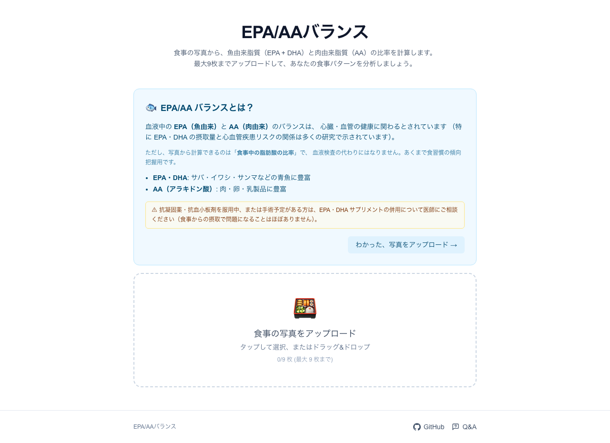

# EPA/AAバランス

[](https://epaaa.mymt.casa)
[](./LICENSE)

食事の写真から **魚由来脂質（EPA + DHA）と肉由来脂質（AA）のバランス**を分析する Web アプリ。

ただ数字を見せるだけではなく、世界の食習慣との比較で**自分の現在地を直感把握**し、AI コーチが**目標食習慣に近づくレシピ**を提案して**行動変容**を促すプロダクトを目指しています。

🌐 **本番**: <https://epaaa.mymt.casa>



---

## 🎯 このアプリでできること

このセクションは「**このツールを採用すべきか / 試すべきか**」を判断するための機能紹介です。

### 1. 食事写真から脂肪酸を計算
最大 **9 枚 / 1 リクエスト**で、複数日分の食事をまとめて分析できます。

写真をアップロードすると:
- Google Gemini Vision API が食材と概算量を識別
- MEXT「食品成分表 脂肪酸成分表編 2020」由来のデータベースで EPA / DHA / AA の mg を集計
- **魚由来脂質割合**を信号機（緑 / 黄 / 赤 / 灰）で判定

### 2. 世界の食習慣との比較 (WOW 体験)
あなたの食事を 5 つの代表的な食習慣と並べ、現在地を直感的に把握できます:

| 食習慣 | EPA+DHA mg/日 | 特徴 |
|---|---|---|
| 標準的アメリカ食 | 150 | 魚は週 1 回未満 |
| 地中海食 | 600 | 週 2-3 回の魚介、オリーブオイル中心 |
| 日本伝統食 | 1,200 | 青魚を週 3-4 回（戦後〜70 年代の標準） |
| ノルウェー食 | 1,700 | 鮭・鯖中心 + 肝油サプリ普及 |
| イヌイット伝統食 (1970 年代以前) | 14,000 | アザラシ・クジラの脂で 90% 以上が魚介由来。現代イヌイットの食事は欧米化が進んでおり、この値はあくまで歴史的な極端値 |

「あなたはここ 👉」マーカーで位置を表示し、「次の食習慣まであと +N mg」と具体食材アクション（例: サバ缶 1 つ追加）を併記。

### 3. WHO / AHA 公的推奨値の達成度
科学的根拠の強い**絶対 mg 摂取量**ベースの公的推奨値との達成度をチップで表示:

- **WHO 一般推奨** 250 mg/日 (FAO/WHO 2010 専門家委員会)
- **AHA 一般推奨 (2002 / 再確認 2017)** 500 mg/日 (週 2 回の oily fish 相当)
- **AHA CVD 二次予防 (2017 年版)** 1,000 mg/日 (心血管疾患既往者向け、Scientific Advisory で「妥当 (Reasonable)」と位置付け)

> **注**: 高用量補充の効果については STRENGTH 試験 (2020) 等で慎重な見解も示されています。本値は 2017 年時点の AHA Scientific Advisory に準拠。

### 4. AI コーチング
あなたが「次に近づける食習慣」を自動算出し、Gemini が**ギャップを埋めるレシピ**を 3 件提案します。
和食寄り / コンビニ / 20分以内 などのチップで提案を絞り込み可 (v0.6.0 でチップごとに食材候補を切り替え、提案の多様性を強化)。
自由入力で「生魚で」「焼き魚で」のように調理法を指定すると、prompt 制約 + 構造化 schema (cookingMethod) +
post-validation の 3 段重ねでその通りのレシピが返るよう設計されています。

> ⚠ **免責**: 本アプリは特定の疾患の予防・診断・治療を目的としたものではありません。提案されるレシピは栄養計算に基づく参考情報であり、個別の疾患に対する食事療法を代替するものではありません。健康状態に懸念がある場合や特定の食事制限が必要な場合は、医師・管理栄養士にご相談ください。

### 5. 透明性のあるオンボーディング
初回訪問時に以下を 30 秒で説明:
- このアプリで何が分かるか
- **食事写真からの計算は血液検査の代わりではない**こと（プロキシ性）
- 抗凝固薬服用者・手術予定者向けの医師相談推奨

リピート訪問時は折りたたみで邪魔にならない設計。

---

## 🔬 何を測るか・何を測らないか

このセクションは「**このツールの限界と科学的位置付け**」を理解するためのもの。

### 主指標 (信号機)
**魚指標 / フィッシュ・インデックス (lipidPct)** = (EPA + DHA) / (EPA + DHA + AA) × 100

食事中の長鎖不飽和脂肪酸 (LC-PUFA) のうち、n-3 系 (EPA + DHA) が占める割合を表します。「魚由来脂質割合」とも併称しますが、厳密には**「LC-PUFA に占める n-3 系の比」**であり、総脂質に占める魚の割合ではありません。

| 信号 | 割合 | 食事傾向の描写 |
|---|---|---|
| 🟢 緑 | ≥ 30% | 魚多めの傾向 |
| 🟡 黄 | 15-29% | 混在傾向 |
| 🔴 赤 | < 15% | 魚少なめの傾向 |
| ⚪ 灰 | データ不足 | 判定不能 |

> **重要**: 信号の色は**食事傾向の描写**であって、健康状態の医学的判定ではありません。AA (n-6 系) も必須脂肪酸で、極端に低すぎる食事も推奨されません。「赤」は「不健康」を意味するものではなく、「魚由来脂肪酸の割合が相対的に低い」という観察結果のラベルです。

> **位置付け**: 30% / 15% は「魚に偏ってるか」を直感把握する**ヒューリスティック**で、血中 EPA/AA 比への直接マッピングは存在しません（AA は内因性合成支配）。閾値の数値そのものに強い科学的アンカーは無いため、当面は維持。詳細は [`lib/standards.ts`](./lib/standards.ts) のコメント参照。

### エビデンスベース指標 (絶対 mg)
心血管疾患リスク低減で**強いエビデンスがあるのは絶対摂取量**です。WHO/AHA 達成チップで併記表示しています。

二指標を併記する設計: lipidPct = 食事傾向把握 / 絶対 mg = エビデンスベース判定。

### プロキシ性（食事 → 血中 → 健康効果のチェーン）
食事中の脂肪酸組成 → 血中 → 健康効果 のチェーンには:
- 8〜12 週間の遅延
- 個人差（FADS1/2 多型等）
- 内因性合成（AA はリノール酸由来が支配的）

があるため、**食事写真からの計算は血液検査の代わりではありません**。あくまで食習慣の傾向把握用です。

### 安全性
サバ缶 (水煮) 100g には EPA + DHA が約 2,000〜3,000 mg 含まれます (出典: 文部科学省「日本食品標準成分表 2020 年版」)。**1 缶 150g で約 3 g に到達**するため、特定の食事日に AHA CVD 二次予防レベル (1,000 mg/日) を大きく超えることは十分にあり得ます。

ただし通常の食生活で **5 g/日を超える継続摂取は困難**で、AHA 2002/2017、EFSA 2012、REDUCE-IT 試験 (2018)、Cochrane Review 2018 (79 RCTs) のいずれも **食品由来の通常摂取で出血リスク増加なし**と結論しています。EFSA 2012 は最大 5 g/日まで安全性懸念なしと明記。

**ただし以下の方は念のため医師にご相談ください**:
- 抗凝固薬・抗血小板剤を服用中
- 出血性疾患の既往あり
- 手術予定がある（1〜2 週間前から）
- サプリメントで 5 g/日を超える摂取を継続している

詳細は [`lib/safety-notes.ts`](./lib/safety-notes.ts) で一元管理しています。

---

## 🚀 使う

### すぐ試す
<https://epaaa.mymt.casa> を開いて、食事の写真をアップロードするだけ。
**認証・登録不要**。

### 自分でホストする
```bash
bun install
cp .env.example .env.local
# .env.local の GEMINI_API_KEY を埋める (https://aistudio.google.com/apikey 無料取得)
bun dev
```

### 環境変数
| 変数 | 必須 | 説明 |
|---|---|---|
| `GEMINI_API_KEY` | ✅ | Google AI Studio で無料取得 |
| `CLOUDFLARE_ACCOUNT_ID` | ⚠ | フィードバック・rate limit 機能を使う場合 |
| `CLOUDFLARE_D1_DATABASE_ID` | ⚠ | 同上 |
| `CLOUDFLARE_API_TOKEN` | ⚠ | 同上 (D1 Edit 権限) |
| `FEEDBACK_ADMIN_TOKEN` | ⚠ | `/admin` GET エンドポイント認証 (32 文字以上推奨) |
| `ADMIN_BASIC_AUTH` | ⚠ | `/admin` ページ Basic Auth (`user:pass` 形式) |
| `IP_HASH_SECRET` | 推奨 | rate limit IP ハッシュの secret (`openssl rand -hex 32`) |
| `COACH_RATE_LIMIT` | 任意 | `/api/coach` 上限 (デフォルト 5 req/h/IP、v0.5.5 で 10 → 5 引き下げ) |
| `ANALYZE_RATE_LIMIT` | 任意 | `/api/analyze` 上限 (デフォルト 10 req/h/IP) |
| `FEEDBACK_ADMIN_RATE_LIMIT` | 任意 | `GET /api/feedback` 上限 (デフォルト 30 req/h/IP) |

⚠ = D1 連携機能（フィードバック保存、rate limit、admin）を使う場合のみ。`GEMINI_API_KEY` だけでもコア機能（写真解析）は動きます。

---

## 🛠 アーキテクチャ

### ファイル構成
```
app/
  page.tsx                            # メイン画面（client、onboarding + upload + result）
  api/analyze/route.ts                # Vision 解析パイプライン（rate limit + telemetry 付）
  api/coach/route.ts                  # AI コーチ提案 (Gemini 2.5 Flash Lite)
  api/feedback/route.ts               # フィードバック収集 + admin GET (rate limit)
  admin/page.tsx                      # フィードバックダッシュボード (Basic Auth)
  layout.tsx                          # RootLayout + Footer

components/
  OnboardingCard.tsx                  # 初回展開・リピート折りたたみ (localStorage)
  UploadZone.tsx                      # 画像アップロード (HEIC 自動変換)
  ResultPanel.tsx                     # 結果まとめ (aggregate + meals grid)
  TrafficLight.tsx                    # 信号機 UI (lipidPct% 中央表示)
  LipidSourceBar.tsx                  # EPA/DHA/AA mg 内訳スタックドバー
  DietPatternComparison.tsx           # 食習慣 5 パターン比較 + WHO/AHA 達成バッジ
  CoachSection.tsx                    # AI コーチ section (5 states + 目標自動算出)
  RecipeCard.tsx                      # レシピ表示
  Footer.tsx                          # GitHub + Q&A グローバルフッター

lib/
  vision.ts                           # Gemini Vision で食材抽出
  food-db.ts                          # 1,971 品目ルックアップ (4 段階 fallback)
  analyzer.ts                         # 食材リスト → AnalysisResult
  scoring.ts                          # 脂質ベース計算 + 信号機判定 (純関数)
  standards.ts                        # 閾値・カテゴリ定義
  session.ts                          # 複数食事 aggregate
  coach.ts                            # AI コーチ prompt + Gemini 呼び出し + バリデーション
  diet-patterns.ts                    # 5 食習慣パターンデータ + 位置算出
  recommendations.ts                  # WHO / AHA 推奨値 + 達成判定
  onboarding.ts                       # localStorage state ヘルパ (SSR セーフ)
  safety-notes.ts                     # 安全性注意事項の中央集権 (出典コメント付)
  d1.ts                               # 共有 D1 REST クライアント
  rate-limit.ts                       # IP ハッシュ + sliding window レート制限
  timing-safe.ts                      # constant-time 文字列比較 (auth 用)
  feedback-validation.ts              # /api/feedback POST バリデーション
  auth.ts                             # /admin Basic Auth ヘルパ

data/
  foods.json                          # 食品 DB 1,971 品目 (MEXT 由来)

migrations/
  0003_add_calculation_version.sql    # feedback テーブル v1/v2 区別
  0004_add_request_log.sql            # rate limit + telemetry テーブル

scripts/
  ingest-mext-foods.ts                # MEXT Excel → foods.json (build-time only)
  migrate-d1.ts                       # REST API ベース migration ランナー (冪等)
```

### パイプライン
```
[1] 初回訪問
    └─ OnboardingCard 展開 (localStorage で初回判定)
       → EPA/DHA + プロキシ性 + 抗凝固薬注意を 30 秒で説明

[2] 写真アップロード
    ├─ HEIC → JPEG 自動変換（クライアント側、heic2any）
    └─ POST /api/analyze (multipart/form-data, 最大 10MB × 9 枚)
       → rate limit check (10 req/h/IP) → Gemini Vision

[3] 食材・分量の特定（Gemini 2.5 Flash）
    └─ JSON Schema 強制出力で具体食材名を抽出
       例: [{"name":"サバ","grams":150}, ...]

[4] 食材ルックアップ (lib/food-db.ts)
    └─ 4 段階 fallback:
       1. exact match
       2. rendaku-aware variant alias.endsWith match
       3. bidirectional substring match
       4. category fallback (脂肪酸データ無し扱い)

[5] 脂肪酸集計
    └─ 各食材 epa_mg × grams/100 を合計 → meal 全体の EPA / DHA / AA mg

[6] 信号機判定 + 結果表示
    ├─ lipidPct = (EPA+DHA) / (EPA+DHA+AA) × 100
    ├─ ≥ 30% → 緑 / 15-29% → 黄 / < 15% → 赤 / 全 null → unknown
    └─ ResultPanel: aggregate → DietPatternComparison → CoachSection → meals grid

[7] AI コーチ (任意)
    ├─ 自動目標算出: findPatternPosition で「次に近づくパターン」を選定
    ├─ POST /api/coach (target patternName + gapMg を含む)
    └─ Gemini が「ギャップを埋める」3 レシピを返す
```

### 食品データベース
`data/foods.json` に **1,971 品目**を収録（MEXT 食品成分表 脂肪酸成分表編 2020 由来）。
各エントリ:

```json
{
  "name": "さば",
  "aliases": ["鯖", "さば", "塩サバ", "焼きサバ", "まさば"],
  "category": "fish",
  "epa_mg": 690,
  "dha_mg": 970,
  "aa_mg": 180,
  "total_lipid_g": 16.8,
  "_mext_row": 1026,
  "_mext_name": "＜魚類＞　（さば類）　まさば　生"
}
```

`Tr` (検出限界以下) → `0 mg`、`—` / 空欄 → `null` (no data) として保存。
カテゴリ: `fish` / `meat` / `egg_dairy` / `plant` / `other`。

ルックアップは正書法・カタカナ / ひらがな・連濁・漢字・複合語の表記揺れに対応（[`lib/food-db.ts`](./lib/food-db.ts)）。

---

## 🧪 テスト
```bash
bun test
```
**175 ケース**（13 ファイル、`bun:test`）。スコア計算 / バリデーション / D1 マイグレーション / coach prompt / 食品 DB schema / 食パターン位置算出 / WHO/AHA 達成判定 / safety-notes 整合性 / 認証 / rate limit ヘルパ等を網羅。

---

## 🚀 デプロイ

**Vercel Hobby tier** で本番運用中。`maxDuration: 45` を `/api/analyze` と `/api/coach` で指定（Hobby tier の上限内）。

D1 マイグレーションは初回 + スキーマ変更時のみ手動実行:
```bash
bun --env-file=.env.local run scripts/migrate-d1.ts
```
冪等。既に適用済みなら SKIP される。

---

## 🔒 セキュリティ

`/cso` 監査済み（[`SKILL.md`](https://github.com/garrytan/gstack) ベース）。実装済み対策:

- **rate limit**: D1 ベース、IP per/hour 制限。`/api/coach` 5/h (v0.5.5)、`/api/analyze` 10/h、`/api/feedback` GET (admin) 30/h
- **IP ハッシュ化**: SHA-256 + `IP_HASH_SECRET` で 16 hex に short hash、生 IP は永続化しない
- **request_log telemetry**: 全リクエスト記録（429 含む）→ brute-force 検知可
- **Timing-safe credential compare**: Basic Auth と admin token に Node 標準 `crypto.timingSafeEqual` を使用
- **Basic Auth**: `/admin` ページを Next.js Proxy 層で保護
- **D1 環境変数未設定時**: rate limit / telemetry を自動 disable（local dev で機能制限なし）
- **xlsx CVE**: devDep + 信頼入力 (MEXT) のみで実害ゼロと判断、受容（[`scripts/ingest-mext-foods.ts`](./scripts/ingest-mext-foods.ts) ヘッダ参照）

---

## 📝 既知の限界

- **画像認識の揺れ**: temperature=0 + JSON Schema で安定化済みだが、暗い・遠い写真や複雑な料理（多層パスタ等）では精度低下
- **lipidPct はプロキシ**: 血液検査ではなく食事傾向の代理指標。8〜12 週間の遅延 + 個人差あり
- **lipidPct 閾値はヒューリスティック**: 30% / 15% に強い科学的アンカーは無い。エビデンスベースは絶対 mg + WHO/AHA 達成チップ側で表現
- **Gemini 無料枠**: AI コーチは Gemini 2.5 Flash Lite (1,000 req/day 無料枠) を使用。混雑時は 503 (QUOTA_EXCEEDED) 返却

---

## 🗓 バージョン履歴

詳細は [`CHANGELOG.md`](./CHANGELOG.md) 参照。主要マイルストーン:

- **v0.4.x** (2026-05-04): WOW 体験 3 ステップ + WHO/AHA バッジ + AI コーチ + 安全性配慮 + footer
- **v0.3.x** (2026-05-03): 脂質ベース計算移行 + MEXT 1,971 品目 + ルックアップ強化 (kanji/rendaku/kuromoji)
- **v0.2.0** (2026-05-02): フィードバック収集 + admin ダッシュボード + Basic Auth
- **v0.1.x** (2026-04-30): MVP（EAA → EPA/AA proxy への移行含む）

---

## 📄 ライセンス

[Apache License 2.0](./LICENSE) で公開しています。

- 商用利用 OK
- 改変・再配布 OK
- 特許権の明示的許可を含む（Apache 2.0 セクション 3）
- 改変版を配布する場合は [`NOTICE`](./NOTICE) ファイルと変更履歴を含めてください

Copyright 2026 eaa-scorer contributors. See [`NOTICE`](./NOTICE) for details.

---

## 🛠 開発ツール

このプロジェクトの設計・実装には [gstack](https://github.com/garrytan/gstack) のスキル群を活用しています:
- `/office-hours` で初期設計
- `/plan-eng-review` でアーキテクチャレビュー
- `/cso` でセキュリティ監査
- `/design-review` でデザイン QA
- `/ship` で PR 化・デプロイ
